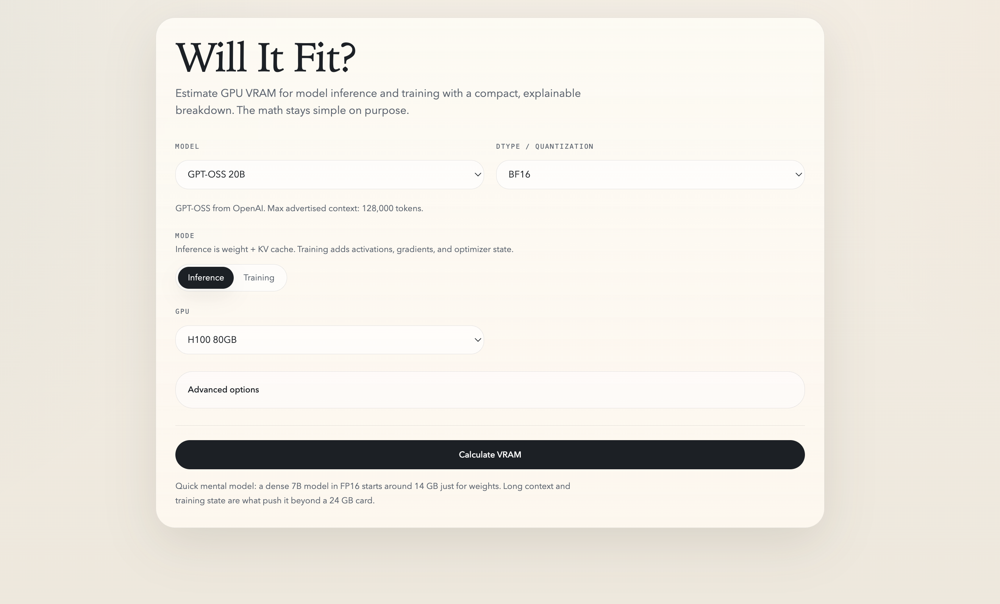

# FitMyGPU

FitMyGPU is a VRAM calculator for inference plus concise model pages and short inference notes.
It is built for one practical question first: will this model fit on this GPU?
Then it adds just enough context around that answer to explain why memory behaves the way it does.

## Preview



## About The Project

FitMyGPU stays intentionally narrow. The homepage is still the calculator, but the site now also includes:

- model pages with short architecture and memory notes
- company pages for browsing model coverage
- a lightweight blog for model, runtime, and calculator updates

The goal is not to become a generic AI directory. The goal is to be a useful inference-planning tool with enough model context to make the numbers easier to trust.

## Features

- VRAM calculator focused on text inference planning
- Runtime-aware fit presets for `transformers` and `vllm`
- Single-GPU and aggregate multi-GPU card-capacity checks for supported serving flows
- Memory breakdown across weights, KV cache, state terms where needed, and runtime overhead
- Compact formula view that explains how the estimate is calculated
- Model pages with `Overview`, `Architecture`, `Research highlight`, `Memory behavior`, and `Sources`
- Company browse pages for grouped coverage
- Short blog posts for new model releases and runtime notes
- Text-only support for multimodal checkpoints, with resident vision weights still counted
- Hugging Face URL import for known models and config-based estimates
- Shareable URL state for calculator inputs and results
- Curated local model registry instead of a noisy unfiltered model dump

## Current Scope

Today the app is focused on:

- inference, not training
- runtime-aware estimates for `transformers` and `vllm`
- model-aware notes for supported registry entries
- honest handling of architecture differences only where the estimator has enough information to model them

The registry is meant to keep growing, but the bar is usefulness, not raw model count.
If a new architecture needs a new memory strategy, it should be added explicitly instead of being forced into a fake universal formula.

## Site Structure

- `/` calculator
- `/models` browseable model index
- `/models/[modelId]` model page
- `/companies/[companyId]` company coverage page
- `/blog` short update index

## Development

Install and run locally:

```bash
npm install
npm run dev
```

Quality checks:

```bash
npm test
npm run lint
npm run build
```

## Support

If this project is useful to you, support it here:

[](https://buymeacoffee.com/kishanvavdara)
